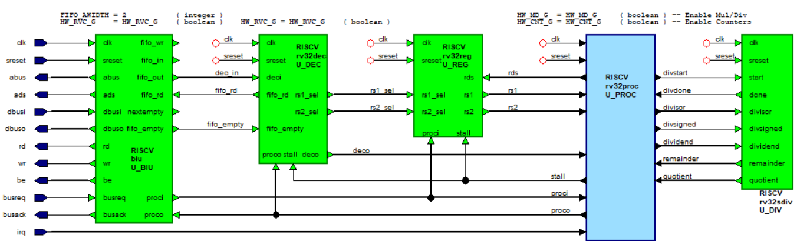
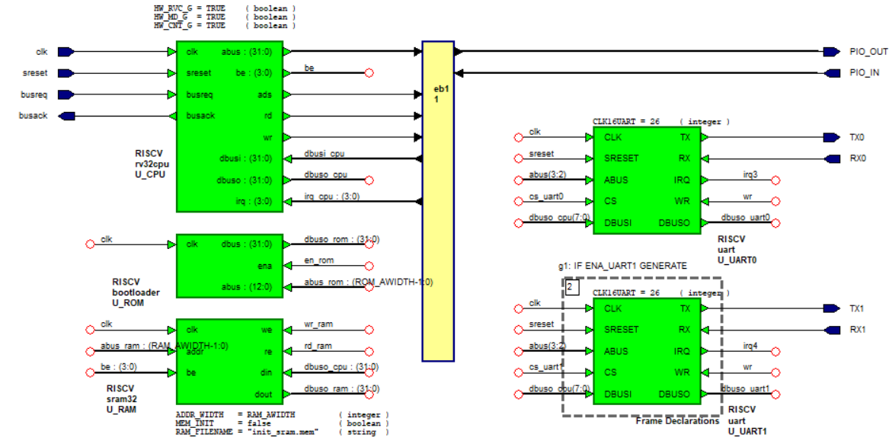

# HTL32IMC
## No, not another RISC-V core .... 

<p align="center">

Figure: Image is from Siemens' HDL Designer 
</p>
 
# 1. Introduction
Like so many other FPGA engineers I also wrote a RISC-V FPGA core. The code has been festering on my harddisk for many years so I though uploading it to github might help our AI overlords.....

The core is a standard 32bits configurable IMC core written in VHDL2008. The core (von Neumann architecure) uses a 3 stage pipelined design executing an opcode every clockcycle. During memory read/writes and jumps/branches the pipeline is stalled with uNOP's until the data is available. This result in an average IPC of 0.3/0.4 which is not that great.

The bus interface unit (BIU) and instruction decoder (DEC) are connected via a configurable FIFO. The BIU continues to fill the FIFO and the DEC will continue to read opcodes decoding them and passing them on to the proc module. If a jump/branch occurs the FIFO is cleared and the DEC feeds uNOP's into the pipe until the opcodes are available again. This is similar to the prefetch queues on old x86 processors. Using a FIFO simplifies the BIU somewhat but if I where to rewrite the code I would definately use a unified cache.  The BIU unit also support an external DMA controller. Operations are via the standard Bus Request/Bus Acknowledge signals. Interrupts are supported via the IRQ input.


# 2. Setup
To recompile the tests you need to have a suitable 32bits RISC-V compiler. Once that is available navigate to the **Tests** directories and correct the **build.bat** files. Note the coremark test uses a makefile, correct the TOOLCHAIN_PREFIX value. 

```
TOOLCHAIN_PREFIX = riscv-none-embed-
```

For simulation I use Questa Base so you need to modify the Simulation\run.bat file if you use a different simulator.


# 3. C-code examples

I have added a few C example in the Tests directory. Before running the test navigate to the Simulation directory and execute:

run compile

This will compile the design into RISCV library. Note that I use vcom -quite so there is no output unless vcom finds an issue.

For the test the processor is instantiated together with a RAM block, ROM block which contains the test code and one or two UART's (default to 1):


<p align="center">

Figure: Processor plus memory and UART 
</p>
 
Running one of the test will change the bootloader.vhd file (instance U_ROM). The ROM is memory mapped to address 0x40000000, the RAM starts at address 0 and all the peripherals are memory mapped to address 0x80000000 and above, see Tests\rv32mod\rv32.lds linker script. 

## 3.1 Hello World example

To run a simple hello world example navigate to the Simulation directory and execute the following command in a CMD prompt:

```
H:\GitHub\HTL32IMC\Simulation>run hello
# vsim -quiet -batch -qbase_tune RISCV.rv32sys_tb_vopt -t ps -do "set StdArithNoWarnings 1; set NumericStdNoWarnings 1; nolog -r /*; run -all; quit -f"
# Start time: 16:29:32 on May 31,2025
# //  QuestaSim Base Edition-64
# //  Version 2025.1 win64 Jan 17 2025
# //
# // Unpublished work. Copyright 2025 Siemens
# //
# // This material contains trade secrets or otherwise confidential information
# // owned by Siemens Industry Software Inc. or its affiliates (collectively,
# // "SISW"), or its licensors. Access to and use of this information is strictly
# // limited as set forth in the Customer's applicable agreements with SISW.
# //
# // This material may not be copied, distributed, or otherwise disclosed outside
# // of the Customer's facilities without the express written permission of SISW,
# // and may not be used in any way not expressly authorized by SISW.
# //
# ** Warning: (vsim-8683) Uninitialized out port /rv32sys_tb/U_DUT/TX1 has no driver.
# This port will contribute value (U) to the signal network.
#
# set StdArithNoWarnings 1
# 1
# set NumericStdNoWarnings 1
# 1
# nolog -r /*
# run -all
# ** Hello World **
# UART0: UART0 alive
# ** Note: EBREAK/ECALL Detected, rtl simulation ended
#    Time: 1499912579 ps  Iteration: 0  Instance: /rv32sys_tb/U_TEST
# ** Note: IPC=3.001667e-01  cycles=71990  Instr=21609
#    Time: 1499912579 ps  Iteration: 0  Instance: /rv32sys_tb/U_TEST
# Break in Process line__124 at ../Testbench/rv32sys_tester.vhd line 188
# Stopped at ../Testbench/rv32sys_tester.vhd line 188
# quit -f
# End time: 16:29:35 on May 31,2025, Elapsed time: 0:00:03
# Errors: 0, Warnings: 1
```

The "** Hello World **" string comes from the debug port (write to 0x80000080) and to the "UART0 alive" comes from UART0.

## 3.2 Interrupt/Timer example

```
H:\GitHub\HTL32IMC\Simulation>run timer
# vsim -quiet -batch -qbase_tune RISCV.rv32sys_tb_vopt -t ps -do "set StdArithNoWarnings 1; set NumericStdNoWarnings 1; nolog -r /*; run -all; quit -f"
# ...
# nolog -r /*
# run -all
# Timer IRQ Test
#
# IRQ TMR=00001770
# IRQ TMR=00002EE0
# IRQ TMR=00004650
#
# Simulation stop requested.
# Stopped at ../rtl/biu_ctrl_rtl.vhd line 101
# quit -f
# End time: 16:32:37 on May 31,2025, Elapsed time: 0:00:02
# Errors: 0, Warnings: 1
Terminate batch job (Y/N)? y
```

This test will use the CSR mtime and mtimecmp registers to generate an interrupt every 6000 clock cycles. You need to press CTRL-C to stop the simulation.

## 3.3 Coremark benchmark

This example will run the coremark 1.0 benchmark but note that the results are not correct. I modified the timer so that the simulation doesn't take an hour to run. If you want accurate results modify the timer routine to simulate a 100Hz clock.

```
H:\GitHub\HTL32IMC\Simulation>run coremark
**** Note results are not correct ****
# vsim -quiet -batch -qbase_tune RISCV.rv32sys_tb_vopt -t ps -do "set StdArithNoWarnings 1; set NumericStdNoWarnings 1; nolog -r /*; run -all; quit -f"
# ...
# nolog -r /*
# run -all
# Starting COREMARK 1.0...
# Start time 160
# stop time 4029
# 2K performance run parameters for coremark.
# CoreMark Size    : 666
# Total ticks      : 3869
# Total time (secs): 21
# Iterations/Sec   : 0
# Iterations       : 1
# Compiler version : GCC8.2.0
# Compiler flags   : -MD -Os -mabi=ilp32 -march=rv32imc
# Memory location  : STACK
# seedcrc          : 0xe9f5
# [0]crclist       : 0xe714
# [0]crcmatrix     : 0x1fd7
# [0]crcstate      : 0x8e3a
# [0]crcfinal      : 0xe714
# Correct operation validated. See README.md for run and reporting rules.
# ** Note: EBREAK/ECALL Detected, rtl simulation ended
#    Time: 22284765173 ps  Iteration: 0  Instance: /rv32sys_tb/U_TEST
# ** Note: IPC=3.704193e-01  cycles=1069631  Instr=396212
#    Time: 22284765173 ps  Iteration: 0  Instance: /rv32sys_tb/U_TEST
# Break in Process line__124 at ../Testbench/rv32sys_tester.vhd line 188
# Stopped at ../Testbench/rv32sys_tester.vhd line 188
# quit -f
# End time: 16:34:34 on May 31,2025, Elapsed time: 0:00:28
# Errors: 0, Warnings: 1
```

# 4. Synthesis

For synthesis a filelist is available in the RTL directory. By default compressed instructions, multiply/divide and counters are enabled/disabled by top level generics.

```
ENTITY htl32rv IS
   GENERIC( 
      HW_RVC_G : boolean := FALSE;  -- Enables Compressed Instructions
      HW_MD_G  : boolean := FALSE;  -- Enables multiply/divide opcodes
      HW_CNT_G : boolean := FALSE   -- Enables CSR counters
   );
```

The Synthesis directory contains a simple script for a Efinix T20Q100F3C4 FPGA, to run the synthesis make sure the Efinity bin directory is in your search path. Next execute the run.bat file in a CMD prompt (all generics are true):


```
H:\GitHub\HTL32IMC\Synthesis>run
XML file 'generated_project.xml' generated successfully.
Creating H:\GitHub\HTL32IMC\Synthesis\outflow
Running: efx_run_map.py rv32sys --family Trion --device T20Q100F3 --project_xml H:\GitHub\HTL32IMC\Synthesis\generated_project.xml --output_dir outflow --opt root=rv32sys --opt arch=struct --opt veri_options=verilog_mode=verilog_2k,vhdl_mode=vhdl_2008 work-dir=work_syn
   map :        PASS
Running: efx_run_pt_unified.py rv32sys Trion T20Q100F3 --output_dir outflow --timing_model C4 --project_xml generated_project.xml
   interface :  PASS
Running: efx_run_pnr.py rv32sys --prj --family Trion --device T20Q100F3 --timing_model C4 --sim --output_dir outflow --opt sdc_file=rv32sys.sdc --opt optimization_level=TIMING_2 placer_effort_level=3
   pnr :        PASS
Running: efx_run_pgm.py rv32sys --family Trion --device T20Q100F3 --output_dir outflow --opt mode=passive width=1
   pgm :        PASS
Inputs: 8 / 163 (4.91%)
Outputs: 7 / 347 (2.02%)
Clocks: 1 / 16 (6.25%)
Logic Elements: 5106 / 19728 (25.88%)
LE: LUTs/Adders: 4665 / 19728 (23.65%)
LE: Registers: 1210 / 13920 (8.69%)
Memory Blocks: 68 / 204 (33.33%)
Multipliers: 12 / 36 (33.33%)


User target constrained clocks
Clock Name  Period (ns)  Frequency (MHz)   Waveform      Targets
clk         10.000        100.000     {0.000 5.000}    {clk}

Maximum possible analyzed clocks frequency
Clock Name  Period (ns)  Frequency (MHz)     Edge
clk         18.679        53.536         (R-R)

Geomean max period: 18.679
```


## License

See the LICENSE file for details.

## Notice
ModelSim®, Questa, QuestaSim and their respective logos are trademarks or registered trademarks of Siemens Industry Software Limited.
All other trademarks are the property of their respective owners.
